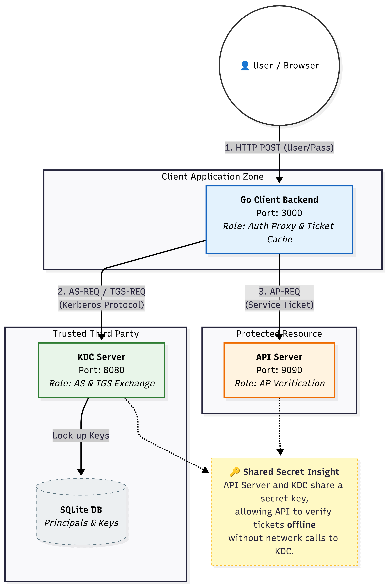

# Kerberos: Serviciu de Autentificare pentru Sisteme Distribuit

Acest proiect reprezintă o implementare a protocolului de autentificare **Kerberos**, bazată pe lucrarea originală *"Kerberos: An Authentication Service for Open Network Systems"* (MIT Project Athena).

Proiectul a fost realizat pentru cursul de **Sisteme Distribuite (2025)**.

## Arhitectură și Workflow

Sistemul Kerberos este bazat pe un model de încredere prin terță parte (*Trusted Third Party*). Diagrama de mai jos ilustrează topologia sistemului și fluxul principal de mesaje între Client, KDC (AS + TGS) și Serverul de Aplicație.

### Componente Principale:
1.  **KDC (Key Distribution Center)**:
    *   **AS (Authentication Server)**: Responsabil pentru autentificarea inițială a utilizatorului și emiterea TGT-ului.
    *   **TGS (Ticket Granting Server)**: Emite tichete de serviciu pe baza unui TGT valid.
2.  **Client**: Aplicația utilizatorului care solicită acces la resurse.
3.  **API Server (Application Server)**: Resursa protejată care verifică tichetele în mod offline.

## Structura Repozitoriului

*   `cmd/`: Punctele de intrare pentru serverele KDC, API și instrumentele de administrare.
*   `internal/`: Logica de bază a protocolului, criptografie, baze de date și middleware.
*   `docs/`: Documentația proiectului în LaTeX și prezentarea finală.
*   `web/`: Frontend-ul aplicației client.

## Demonstrație

Pentru instrucțiuni detaliate despre configurarea și rularea unui demo, consultați [DEMO_GUIDE.md](DEMO_GUIDE.md).

## Autori
*   Prioteasa Liviu Florentin
*   Rizescu Iulian Ștefan
*   Țacu Ștefan Darius
